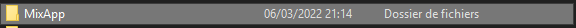
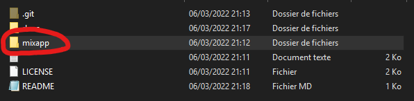
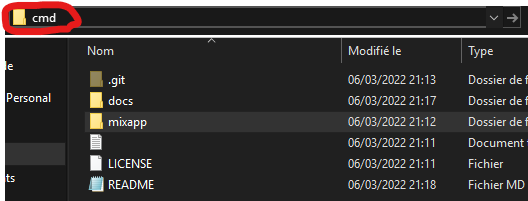

# Deleting applications with MixApp.

- Firstly, go into MixApp's folder:
<br></img>

- Then, go into "**mixapp/**" folder:
<br></img>

- After, open a terminal in it by doing this:
<br></img>

And press "***ENTER***" key.

For renaming a app, enter this in a terminal.

**Preview**:
<br></img>

````batch
mixapp.py -editapp name <your app's name> <new name>
````

For coding a app, enter this in a terminal.

**Preview**:

<br></img>

````batch
mixapp.py -editapp gui <your app's name>
````

And now, you created your first application with MixApp !
Now, your app has located in "**mixapp**" folder. Keep your file in this folder !
⚠ **If you move your file, you couldn't change his name or do more.**