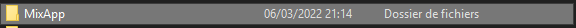
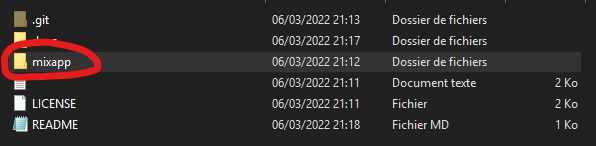
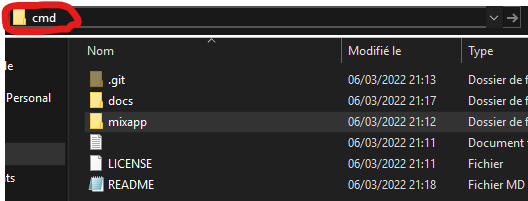
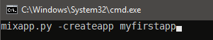

# Making applications with MixApp.

- Firstly, go into MixApp's folder:
</img>

- Then, go into "**mixapp/**" folder:
</img>

- After, open a terminal in it by doing this:
</img>

And press "***ENTER***" key.

For making your first app, enter this in a terminal.

**Preview**:
</img>

````batch
mixapp.py -createapp myfirstapp
````

And now, you created your first application with MixApp !
Now, your app has located in "**mixapp**" folder. Keep your file in this folder, 
⚠ **If you move your file, you couldn't change his name or do more.**